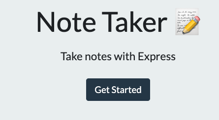
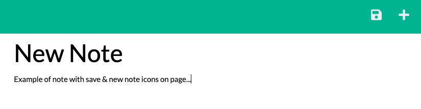

# Challenge: Note Taker

Deployed link: https://overtonr-note-taker.herokuapp.com/Links

## Description
This note-taker application is used to write and save notes after being presented with an initial landing page. Users can click the link to be navigated to the notes page, and once a note with a corresponding title is added, they can click the save icon that appears. Users can also retrieve previously saved notes by clicking on them from the column.

[](https://opensource.org/licenses/MIT)


## Table of Contents
---
- [Installation](#installation)
- [Usage](#usage)
- [License](#license)
- [Contributing](#contributing)
- [Questions](#questions)


## Installation
Website page is interactive without any necessary installation.

## Usage
Users can click the "Get Started" button on the landing page. 



This will navigate users to the corresponding notes application.
```
//GET route for landing page
app.get('/', (req,res) =>
    res.sendFile(path.join(__dirname,'/public/index.html'))
);

//GET route for note page
app.get('/notes', (req,res) =>
    res.sendFile(path.join(__dirname,'/public/notes.html'))
);
``` 
The layout contains a column to the left, which stores saved notes and thier titles once the user clicks on the save icon. Selecting a saved note retrieves the data and repopulates it into the left column. When a user clicks the "+" icon at the top of the page, the note section is cleared and they can enter an new note. 




## License
This application is covered under the MIT License


## Contributing
None


## Questions
https://github.com/overtonr
If you have any questions, please feel free to contact me through my email : overtonr.